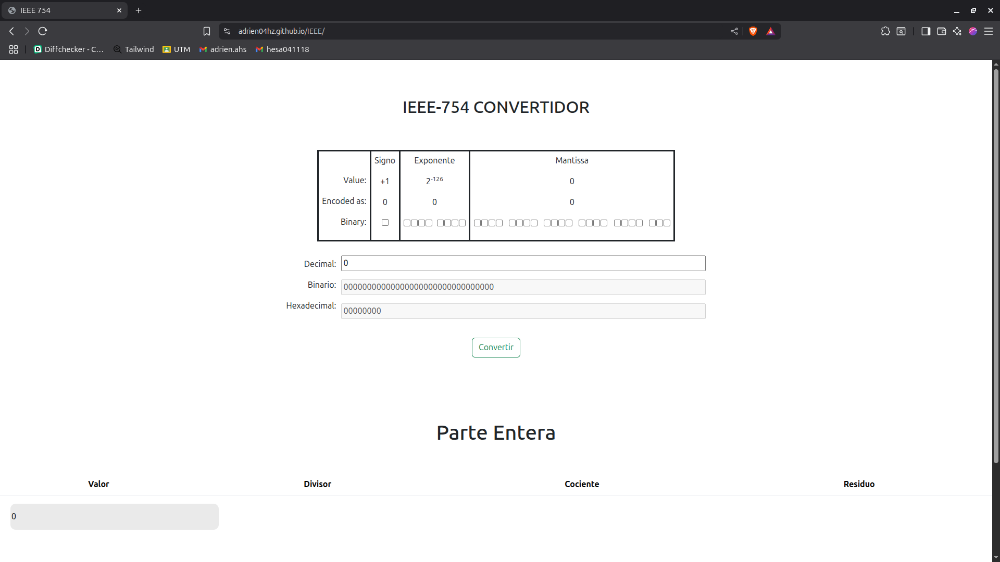

# CONVERTIDOR DE DECIMAL A BINARIO IEEE 754

Proyecto realizado el `27 de noviembre del 2024` para la asignatura de Programación web. Se utilizaron tecnologías como CSS, HTML y JavaScript.

### DEMOSTRACIÓN

Dar clic en la imagen para probar la página.

